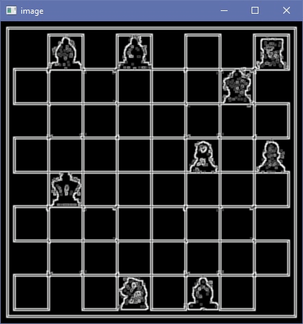

# Img2FEN
Generate FEN from chessboard image.

Using OpenCV for image processing and PyTorch for piece recognition.

Not as robust as I'd like it to be. But it somehow works sometimes. :)


# Usage
## 1. Install
```bash
$ git clone
$ cd img2fen
$ pip install -r requirements.txt
```

You also need to install PyTorch and TorchVision. Please refer to the [official website](https://pytorch.org/) for installation.

## 2. Run
```bash
$ python img2fen.py <input_image_path>
```

# Example
## Input
 

## Output
```bash
FEN 0: 1b1B3r-6k1-8-5P1p-1K6-8-8-3n1B2
```